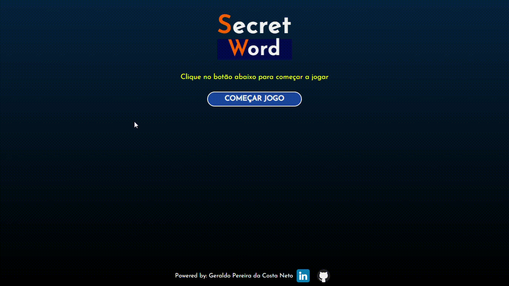
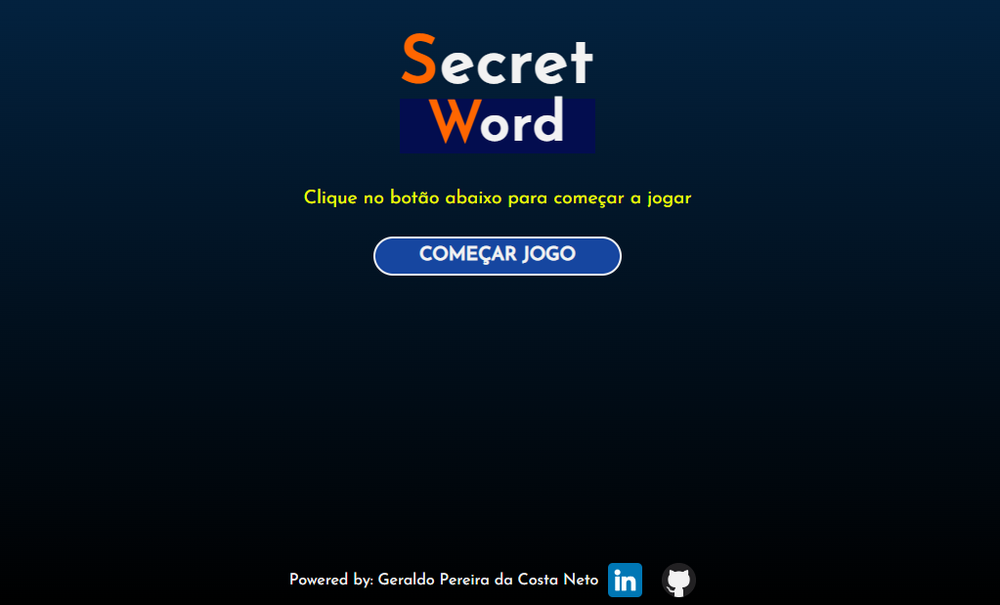
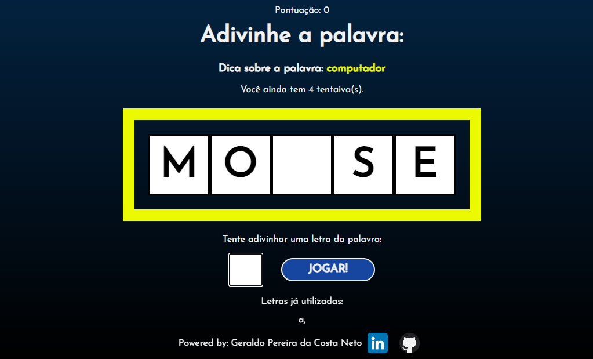
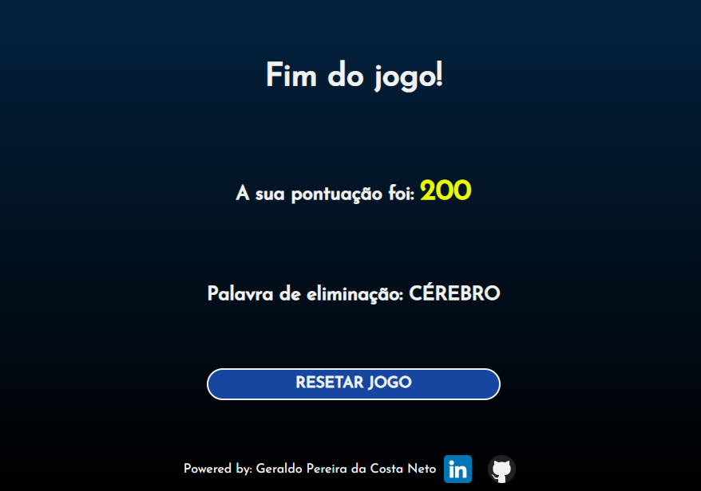

# Projeto 1 curso React.js da Udemy: Secret-Word

<hr>

## Gif do projeto


## Start Game Page


## Game Page


## Game Over Page


# Install
Clone this repository and install it dependencies with this command: 
```sh
$ npm install
```

# Running
Run the application with `npm start` command, it will start the app:
```sh
$ npm start
